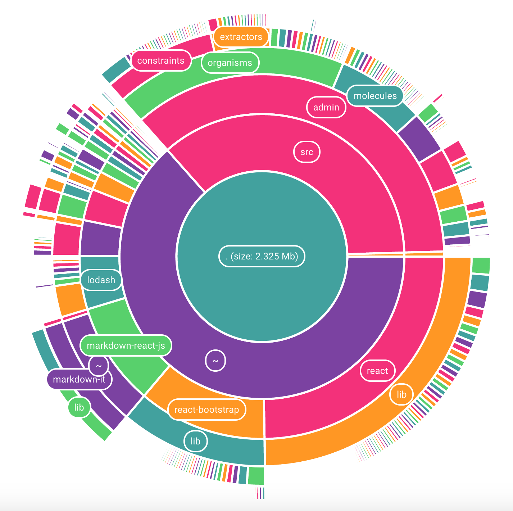

# cake-chart

Interactive multi-layer pie chart



### Demo

[Webpack Chart](http://alexkuz.github.io/webpack-chart/)

### Install
```
> npm i -S cake-chart
```

### Simple Example

```
import CakeChart from 'cake-chart';

const TREE = {
  value: 100,
  label: 'SUM = 100',
  children: [{
    value: 50,
    children: [{
      value: 10
    },
    {
      value: 20
    }]
  }, {
    value: 30
  }, {
    value: 20
  }]
};

...

render () {
  return (
    <CakeChart data={TREE} />
  );
}
```

### Advanced Example

#### Tree Navigation

CakeChart is a quite dumb component that renders provided tree, but doesn't navigate through it, so you have to implement that part yourself. Which is not hard though.

```js
const TREE = { ... };

/* finds parent of the selected node -
   you can just store parent in the node itself, for example */
function findParentNode(node, child, parent = null) {
  if (node === child) return parent;
  for (let c of child.children || []) {
    const p = findParent(node, c, child);
    if (p) return p;
  }
}

class InteractiveCakeChart extends React.Component {
  constructor(props) {
    super(props);
    
    this.state = {
      selectedNode: TREE
    }
  }
  
  render() {
    return (
      <CakeChart data={this.state.selectedNode}
                 onClick={this.handleClick} />
    );
  }
  
  handleClick = (node) => {
    if (node === this.state.selectedNode) {
      /* user clicked on the chart center - rendering parent node */
      this.setState({ selectedNode: findParentNode(node, TREE) || TREE });
    } else {
      this.setState({ selectedNode: node });
    }
  }
}
```

#### Customization

```js

function getSliceProps(slice, props) {
  return { ...props, fill: (slice.level % 2) ? '#FF0000' : '#0000FF' };
}

function getLabel(slice, label) {
  return slice.level === 0 ? `Value: ${slice.node.value}` : label;
}

function getLabelProps(slice, props) {
  return { ...props, style: { background: (slice.level % 2) ? '#FF0000' : '#0000FF' } };
}

class CustomizedCakeChart extends React.Component {
  render() {
    return (
      <CakeChart data={TREE}
                 coreRadius={120}
                 ringWidth={80}
                 ringWidthFactor={0.6}
                 getSliceProps={getSliceProps}
                 getLabelProps={getLabelProps}
                 getLabel={getLabel} />
    );
  }
}
